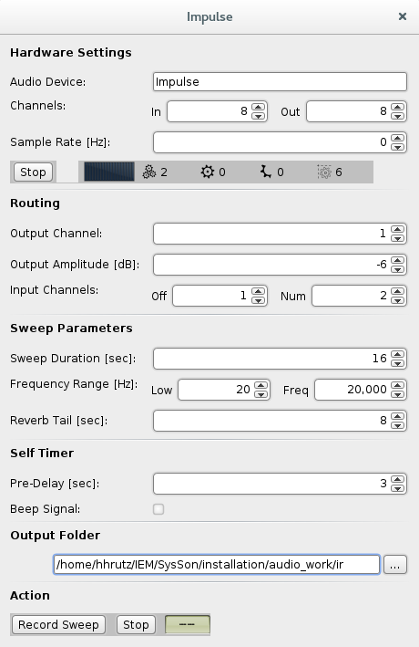

# Impulse

## statement

Impulse is a simple tool to record sound impulse responses. It is (C)opyright 2014&ndash;2018 by Hanns Holger Rutz. All rights reserved. This project is released under the [GNU General Public License](https://raw.github.com/Sciss/Impulse/master/LICENSE) v3+ and comes with absolutely no warranties. To contact the author, send an email to `contact at sciss.de`

## requirements / installation

Impulse builds with sbt against Scala 2.12, 2.11. To create the standalone, run `sbt assembly`. For simplicity, the shell script `sbt` is included, written by [Paul Phillips](https://github.com/paulp/sbt-extras) and released under BSD-style license. Thus, if you do not have sbt installed, you can build using `./sbt assembly`.

You can also use sbt to launch the application via `sbt run`. The project is based on ScalaCollider/SoundProcesses and thus an existing SuperCollider installation is required. The SuperCollider location is currently read from environment variable `SC_HOME`. On Linux, `scsynth` should be on your `PATH`, so there is no action required.

If you download a binary release ("universal" zip), you have to unpack the zip file and launch `bin/impulse` (Linux and Mac)
or `bin/impulse.bat` (Windows). You can do that by calling these script files from a terminal or command prompt, or from
the desktop environment by using right-click and selecting to execute these files.

## GPL note

Also relevant to the binary download: The license is GPL, and the project depends on other GPL'ed libraries.
The GPL requires that we make all source code available. Please please follow the links to the respective GitHub repositories:

- [WebLaf](https://github.com/mgarin/weblaf)
- [Submin](https://github.com/Sciss/Submin)
- [ScalaCollider-Swing](https://github.com/Sciss/ScalaColliderSwing)
- [Impulse](https://github.com/Sciss/Impulse)

## contributing

Please see the file [CONTRIBUTING.md](CONTRIBUTING.md)

## quick guide

Impulse is currently a one-window tool. All settings can be adjusted in this window, they will be automatically saved as preferences.

The program produces a sine sweep that is output to a particular speaker channel. The corresponding response is recorded through microphone channels. A bit of manual post-processing is needed to get the actual impulse response. This is described at the end of this document.

### hardware settings

Select the audio-device and maximum number of input and output channels needed. On Linux, 'Audio Device' corresponds with the Jack client name. The number of channels must be high enough so that you can access the desired input and output channel (even if just recording mono).

A sample-rate value of zero indicates that the rate is used at which the audio-interface currently runs.

### routing

- 'Output Channel' - the channel onto which the monophonic sine sweep is played. This is 1-based, so 1 is the first channel of your audio interface
- 'Output Amplitude' - the signal strength (peak sine amplitude) in decibels
- 'Input Channels' - 'Off' specifies the first microphone input channel (1-based). `Num` specifies the number of microphone channels used, e.g. 1 for mono-phonic, 2 for stereo.

### sweep parameters

The sweep is a sine oscillator linearly progressing from the `Low` to the `High` frequency range parameters over the duration given as `Sweep Duration`. Because the impulse response will take time to decay, the `Reverb Tail` duration will be added to the recording time. This should be the expected reverberation time.

### self timer

In order to avoid that some initial sounds from operating the program end up on the recording - for example the mouse-clicks when pressing 'Record Sweep', a pre-delay time may be specified here. This is the amount of time the process waits after pressing 'Record Sweep' before the actual sweep is produced. The 'Beep' function is not yet implemented.

### output folder

The recorded impulse responses will be saved inside this folder, using an automatic naming scheme that includes the date and time of the recording.

### action

The 'Record Sweep' button becomes enabled after the SuperCollider server is ready. To boot the server, press the 'Boot' button in the 'Hardware Settings' section first. Make sure your channels are correctly routed in Jack (on Linux).

After pressing 'Record Sweep', the process waits for 'Reverb Tail' seconds, indicated by a negative counter. When the counter reaches zero, the actual sound production and recording begins. For this time, the button is disabled. After the recording is complete, the button is re-enabled and the counter stops. At any time, a recording can be aborted by pressing the 'Stop' button.

## post processing

The post processing is currently not yet automatised. You end up with sound files that contain in their first channels the dry sweep signal and in the remaining channels the recorded microphone signal.

We assume that your sound editor is [Eisenkraut](https://github.com/Sciss/Eisenkraut), and your post-processing tool is [FScape](https://github.com/Sciss/FScape).

- Open the output file in Eisenkraut. Select only the first channel (dry sweep), select the duration of the sweep ('Sweep Duration' in Impulse). Select 'File > New > Document from Selection'. You have the isolated sweep signal. Select all and run 'Process > Reverse'. Save the result. This will be input A of your eventual convolution.

- Now go back to the original file and select all channels but the first, i.e. only the microphone signal. Select 'File > Save Selection As' and choose a new name. This will be input B of your eventual convolution.

- Open FScape. Select 'New Module > Spectral Domain > Convolution'. Choose the two inputs A and B produced in the previous steps. Run process.

- Open the result again in Eisenkraut. You will have to cut away at least 'Sweep Duration' seconds in the beginning. Trim the ending as necessary to keep as much of the reverb tail as desired.
